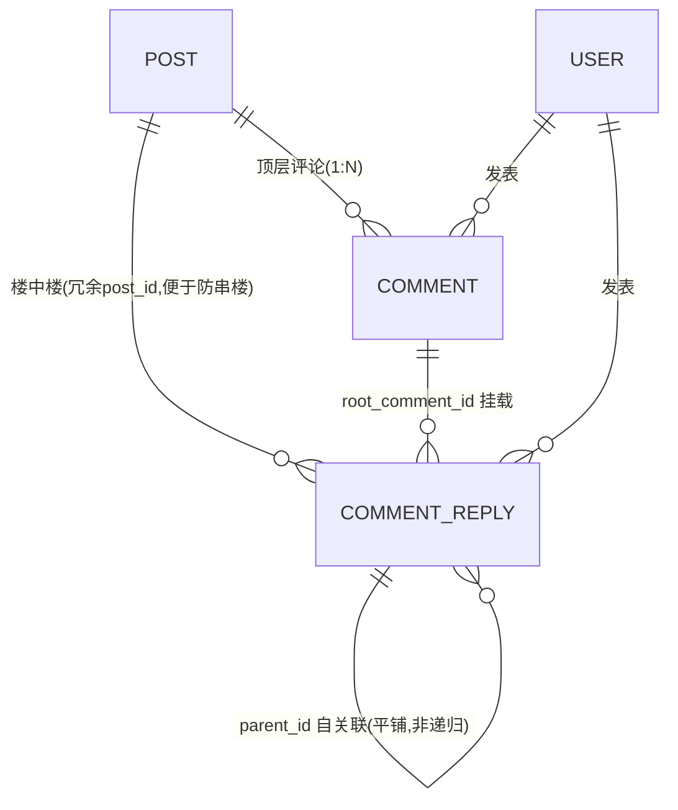
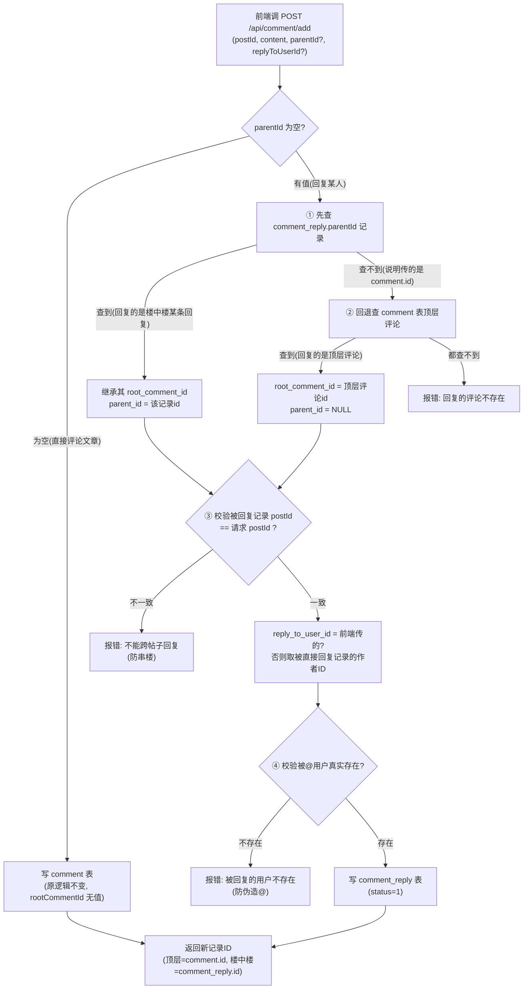
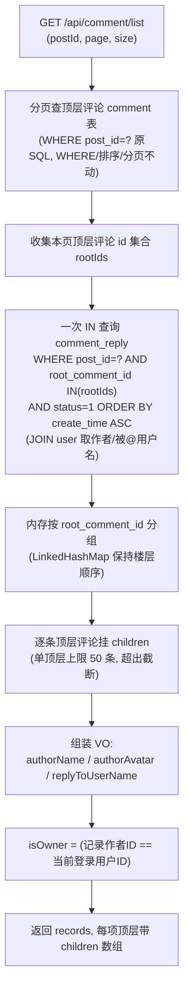
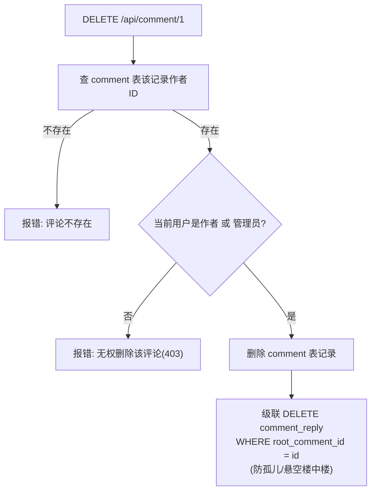
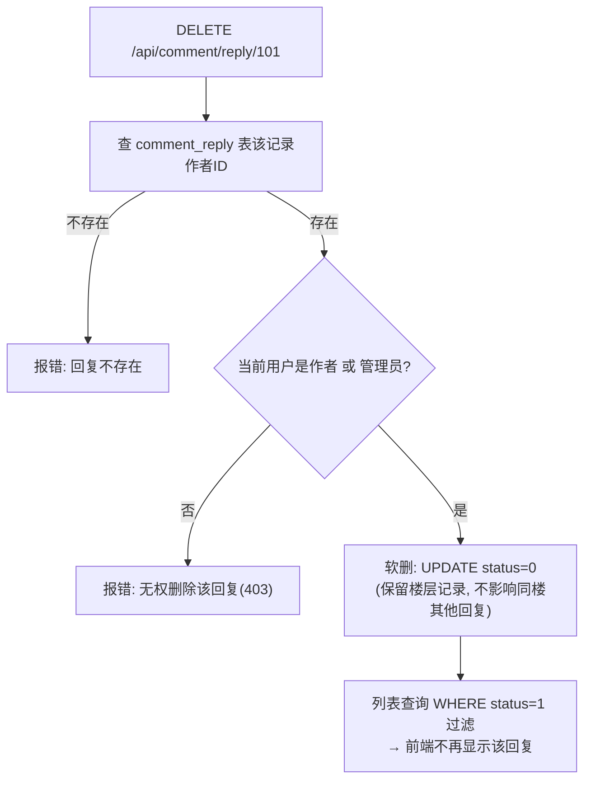

# 评论楼中楼（多级回复）业务流程图

> 后端实现说明文档。配套开发文档：《评论楼中楼前后端开发文档.md》
> 核心思路：**不改原 `comment` 表**，新增 `comment_reply` 表承载所有"回复"，实现 B 站式两级评论（顶层评论 + 平铺楼中楼）。

---

## 一、整体架构：两张表 + 挂载关系

```
┌─────────────────────────────────────────────────────────────┐
│                        文章 / 帖子 (post)                     │
│                          ↑ 1:N                              │
│  ┌──────────────────────┴───────────────────────────┐        │
│  │                                                 │        │
│  │  comment 表（顶层评论，原表，不动）                │        │
│  │  id │ post_id │ user_id │ content │ create_time │        │
│  │      ↑ 1:N 挂载(root_comment_id 指向 comment.id)  │        │
│  └──────┼──────────────────────────────────────────┘        │
│         │                                                  │
│  ┌──────┴───────────────────────────────────────────┐        │
│  │  comment_reply 表（楼中楼回复，新增）               │        │
│  │  id │ post_id │ root_comment_id │ parent_id │    │        │
│  │     │ user_id │ reply_to_user_id │ content      │        │
│  │     └── parent_id 自关联（NULL=直接回复顶层）      │        │
│  └─────────────────────────────────────────────────┘        │
└─────────────────────────────────────────────────────────────┘
```

**要点：**
- 顶层评论在 `comment` 表，直接评文章；分页只作用于它。
- 所有"回复"都平铺在 `comment_reply` 表里，通过 `root_comment_id` 挂到某条顶层评论下，**不做递归树**。
- `parent_id` → 指向 `comment_reply.id`；`root_comment_id` → 指向 `comment.id`。两者指向不同表，不要混用。

ER 图：



---

## 二、发表评论（POST /api/comment/add）业务流程图

前端只传 `postId / content / parentId(可选) / replyToUserId(可选)`，后端根据 `parentId` 是否为空自动分流。



**校验顺序说明（重要）：** 必须先查目标记录是否存在，再比对 `postId`。防止用户拿别的帖子的 `parentId` 来串楼。

---

## 三、获取评论列表（GET /api/comment/list）业务流程图

分页只作用于顶层评论；楼中楼一次 `IN` 查询全量带回，内存按根分组，避免 N+1。



**返回结构示例：**

```json
{
  "code": 200,
  "data": {
    "records": [
      {
        "id": 1, "postId": 10, "userId": 5, "content": "我也觉得",
        "authorName": "王五", "authorAvatar": "https://...",
        "createTime": "2024-01-15 16:00:00", "isOwner": false,
        "children": [
          {
            "id": 101, "postId": 10, "rootCommentId": 1, "parentId": null,
            "userId": 8, "replyToUserId": 5, "replyToUserName": "王五",
            "authorName": "张三", "authorAvatar": "https://...",
            "content": "顶一下", "createTime": "2024-01-15 17:00:00", "isOwner": true
          }
        ]
      }
    ],
    "total": 15, "page": 1, "size": 20
  }
}
```

---

## 四、删除流程

### 4.1 删除顶层评论（DELETE /api/comment/{id}）



### 4.2 删除楼中楼回复（DELETE /api/comment/reply/{id}，新接口）



> 为什么楼中楼单独一个删除接口？顶层评论 id 和楼中楼回复 id 可能撞号，URL 参数区分不了。所以新增 `DELETE /api/comment/reply/{id}`，职责清晰。

---

## 五、接口清单

| 方法 | 路径 | 登录 | 说明 |
|---|---|---|---|
| POST | `/api/comment/add` | ✅ | 发表评论/回复，`parentId` 为空走顶层、有值走楼中楼；返回新记录ID |
| GET | `/api/comment/list` | ❌ 公开 | 分页查顶层评论，每项带 `children` 楼中楼；带有效 Token 时识别 `isOwner` |
| DELETE | `/api/comment/{id}` | ✅ | 删顶层评论，级联清理其下楼中楼；作者或管理员 |
| DELETE | `/api/comment/reply/{id}` | ✅ | 删楼中楼回复（软删）；作者或管理员 |

---

## 六、核心字段语义速查

| 字段 | 所属表 | 语义 |
|---|---|---|
| `root_comment_id` | comment_reply | 必填，指向 `comment.id`。楼中楼渲染/级联删除/分组都靠它 |
| `parent_id` | comment_reply | 可选，指向 `comment_reply.id`。`NULL`=直接回复顶层评论 |
| `reply_to_user_id` | comment_reply | 被@用户。不传则默认取被直接回复记录的作者 |
| `post_id` | comment_reply | 冗余，便于按帖子查 + 校验防串楼 |
| `status` | comment_reply | 1正常 0已删除（软删） |

---

## 七、后端改动文件清单

| 端 | 文件 | 变更 |
|---|---|---|
| DB | `src/main/resources/migration-comment-reply.sql` | 新增 `comment_reply` 表 |
| 后端 | `pojo/CommentReply.java` | 新增实体 |
| 后端 | `vo/CommentReplyItemVO.java` | 新增 VO（含 `userId/isOwner`） |
| 后端 | `dto/AddCommentDTO.java` | 加 `parentId / replyToUserId`（+内部回填 `id`） |
| 后端 | `vo/CommentItemVO.java` | 加 `userId / isOwner / children` |
| 后端 | `mapper/CommentMapper.java` + `.xml` | 回复插入/IN查询/软删/级联删/顶层回退查询 |
| 后端 | `service/CommentService.java` + `Impl` | add 分流、list 组装 children、deleteCommentReply、级联、管理员权限 |
| 后端 | `controller/CommentController.java` | add 返回 id；list 解析登录态；新增 reply 删除接口 |
| 后端 | `service/Impl/PostServiceImpl.java` | 帖子详情的评论列表也挂 children |
| 后端 | `mapper/PostMapper.xml` | `commentCount` 统计含回复数（文档 5.4） |

---

## 八、注意事项（实现中已落实）

1. **`root_comment_id` 绝不信任前端**，一律从被回复记录继承。
2. **先查目标存在、再比对 postId**，防跨帖子串楼。
3. **删除顶层评论必级联清理回复**，避免孤儿数据。
4. **楼中楼一次 IN 查询带回**，不做 N+1。
5. **单顶层回复上限 50 条**（内存截断），避免超大帖拖垮接口。
6. 删除权限：作者本人或管理员；楼中楼软删保留楼层。
7. 老存量评论没有 `children`，前端 `comment.children?.length` 判空即可，零迁移兼容。
8. 无回复的顶层评论 `children` 返回空数组 `[]`，保证前端数据结构稳定。

---

## 九、后端联调验证记录（2026-08-10 实测通过）

> 已在本地 MySQL（`my_web_school_project`）+ 实际运行的后端上逐项验证，测试数据已清理。

| 场景 | 请求 | 预期 | 实测 |
|---|---|---|---|
| 发表楼中楼回复（回复顶层评论） | `POST /api/comment/add` `{postId:2, parentId:2}` | 返回 reply.id；`root_comment_id=2`、`parent_id=null`、`reply_to_user_id=顶层作者` | ✅ |
| 发表楼中楼回复（回复某条回复） | `parentId=<reply.id>` | 继承 `root_comment_id`，`parent_id=<reply.id>` | ✅ |
| 伪造 @ | `replyToUserId=999999` | 400 被回复的用户不存在 | ✅ |
| 跨帖子回复 | `postId=8, parentId=2` | 400 不能跨帖子回复 | ✅ |
| 目标不存在 | `parentId=999999` | 404 回复的评论不存在 | ✅ |
| 空内容 / 超 500 字 | `content="  "` / 501字 | 400 | ✅ |
| 未登录发评论 / 删回复 | 无 Token | 401 | ✅ |
| 评论列表组装 children | `GET /api/comment/list?postId=2` | 顶层带 `children`，字段齐全 | ✅ |
| isOwner 判断 | 带 Token / 不带 Token | 本人 true，未登录 false | ✅ |
| 无回复顶层 children | `GET /api/comment/list` | 返回 `[]` 空数组 | ✅ |
| 作者删除回复 | `DELETE /api/comment/reply/{id}` | 软删成功，列表不再显示 | ✅ |
| 重复删除（已软删） | 再次 DELETE 同一 id | 404 回复不存在 | ✅ |
| 越权删除 | 普通用户删他人回复 | 403 无权删除该回复 | ✅ |
| 管理员删除任意 | 管理员 Token 删普通用户回复 | 成功 | ✅ |
| 帖子详情评论 | `GET /api/post/{id}` | 评论同样带 `children` | ✅ |
| commentCount 含回复数 | `GET /api/post/list` | 顶层评论数 + 有效回复数 | ✅（代码已改） |
